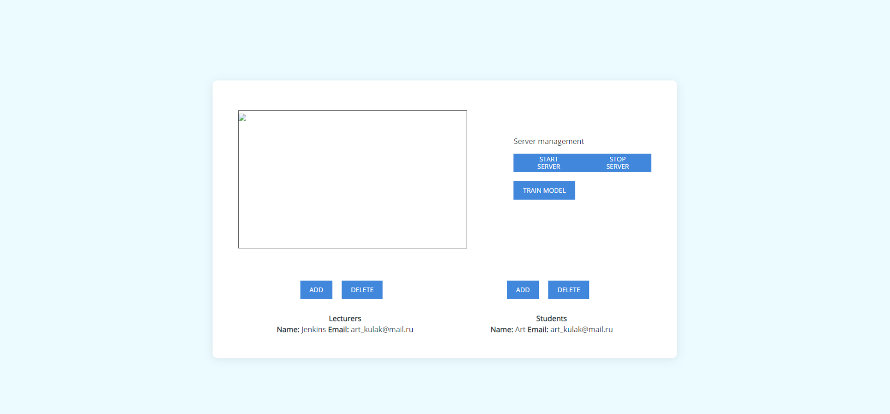

# Class Attendance Web App with Flask

This repo contains an implementation of the web app for live class attendance capture with the help of the face recognition.

The pipeline of adding the new student for the model is expressed below.

The interface of the app is really simple. The app has student, admin and teacher users. Each user is recorded in his own database record and has his own functions.

Here are some screenshots of the Flask based interface.

## Instructions
1. Clone the repo and run `pip -r install requirements.txt`
2. Run `python Website.py`
3. Login as `admin`:`123456` and start adding teachers and users to the database
4. Take individual photo for each `student` and retrain the model as `admin`
5. Finally take attendance as `teacher`
